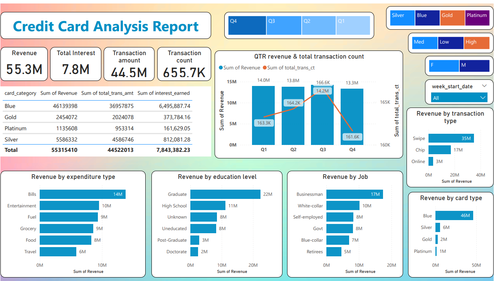
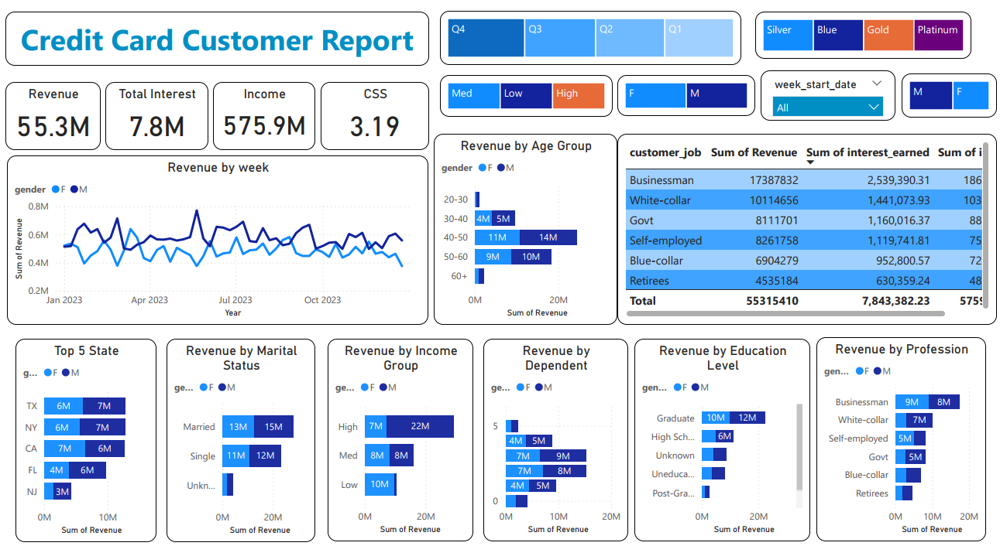

# Credit_Card_Analysis_Report

# Credit Card Transaction Analysis Dashboard

## Overview
This project analyzes credit card transaction data using PowerBI and SQL to provide comprehensive insights into customer behavior, revenue patterns, and transaction trends. The dashboard includes analysis of card categories, customer demographics, spending patterns, and revenue distribution across different segments.

## Dashboard Screenshots
### Credit Card Analysis Report

- Revenue metrics and quarterly trends
- Transaction type distribution
- Revenue breakdown by education, job, and expenditure type
- Card category performance

### Credit Card Customer Report

- Customer demographic analysis
- Revenue trends by gender
- Geographic distribution
- Customer segmentation by income, education, and profession

## Features
- **Revenue Analysis**
  - Breakdown by card category (Blue, Silver, Gold, Platinum)
  - Week-over-week revenue comparison
  - Quarterly revenue trends with transaction count correlation
  - Revenue distribution by expenditure type (Bills, Entertainment, Fuel, etc.)

- **Customer Segmentation**
  - Analysis by education level
  - Professional background distribution
  - Income group categorization
  - Age group analysis
  - Geographic distribution (Top 5 states: TX, NY, CA, FL, NJ)

- **Transaction Insights**
  - Transaction method analysis (Swipe: 35M, Chip: 17M, Online: 3M)
  - Total transaction amounts and counts
  - Interest earned metrics
  - Customer satisfaction scores (CSS: 3.19)

## Database Structure
The project uses PostgreSQL with two main tables:

### cc_detail
- Transaction-related information
- Card category details
- Weekly and quarterly metrics
- Transaction amounts and counts
- Interest earned

### cust_detail
- Customer demographics
- Geographic information
- Professional details
- Income information
- Satisfaction scores

## Key Metrics
- Total Revenue: $55.3M
- Total Interest Earned: $7.8M
- Total Transaction Amount: $44.5M
- Transaction Count: 655.7K
- Total Income: $575.9M

## Technical Stack
- **Database**: PostgreSQL
- **Visualization**: Power BI Desktop
- **Data Processing**: SQL

## Installation and Setup
1. Create a PostgreSQL database using the provided SQL scripts
2. Execute the table creation queries
3. Import data using the COPY commands
4. Connect Power BI to the PostgreSQL database
5. Load the .pbix file to view the dashboard

## Project Structure
```
├── sql/
│   └── table_creation_queries.sql
├── data/
│   ├── credit_card.xlsx
│   └── customer.csv
├── powerbi/
│   └── credit_card_analysis.pbix
├── images/
│   ├── credit_card_analysis_report.png
│   └── credit_card_customer_report.png
└── README.md
```

## Key Insights
- Blue card category dominates revenue generation ($46M)
- Businessmen contribute the highest revenue ($17.3M) and interest earned ($2.5M)
- Graduate education level shows highest revenue ($22M)
- Swipe transactions lead with $35M in revenue
- Bills category leads expenditure with $14M
- Age group 40-50 shows highest engagement
- Married customers generate higher revenue ($28M combined)
- High-income group contributes $29M to total revenue

